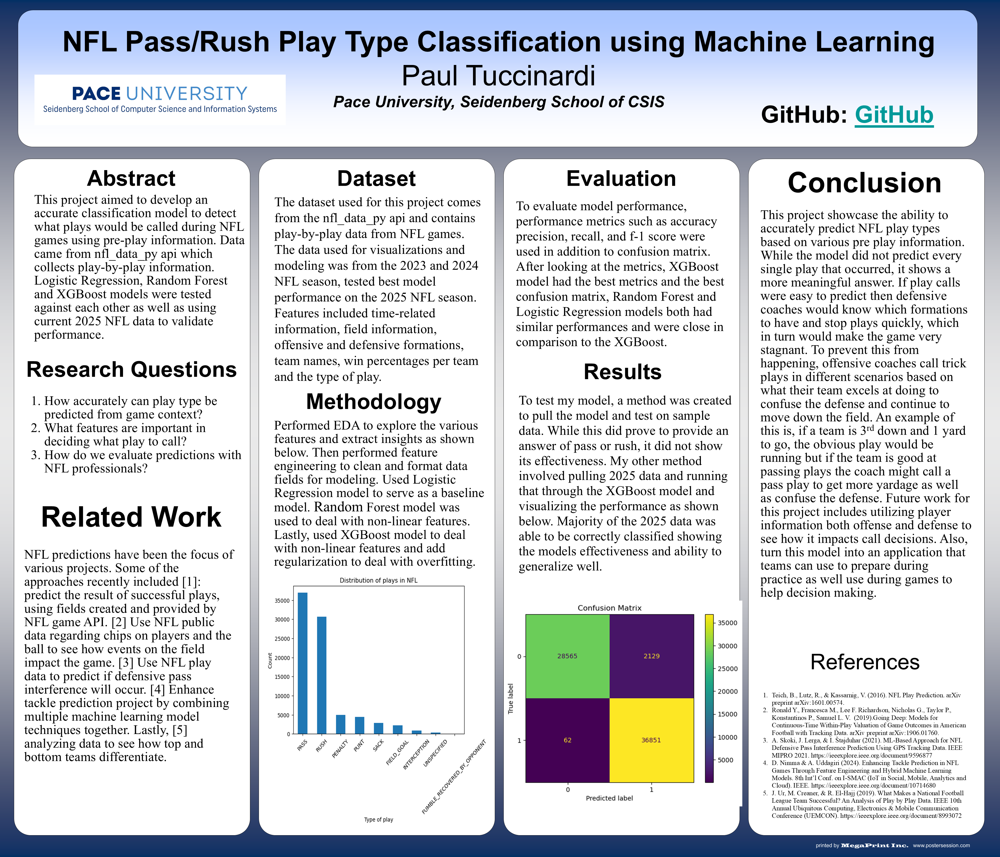

# NFL_Pass_Rush_Play_Type_Classification

Author: Paul Tuccinardi

Email: <paultuccinardi@gmail.com>

- *This work was realized as part of the capstone project of the MS in Data Science at Pace University*
- [Presentation](https://docs.google.com/presentation/d/1XdqbENslfI0Xlb9LvI7pxhbnrJYTUn9IyHMeEUtnppA/edit?usp=sharing)
- [Mid_Semester_Slides](https://docs.google.com/presentation/d/1Bf9rF0JXRG_AY0W--8b1qA4n3lWFdR-tNSC4mPW1zOc/edit?usp=sharing)
- [Mid_Semester_Video](https://drive.google.com/file/d/13IJOqT-aCOZuQOR-Z4o1ghhv2u1iNZZ5/view?usp=sharing)

## Project Details
- **Abstract**: This project aimed to develop an accurate classification model to detect what plays would be called during NFL games using pre-play information. Data came from nfl_data_py api which collects play-by-play information.  Logistic Regression, Random Forest and XGBoost models were tested against each other as well as using current 2025 NFL data to validate performance.

- **Dataset**: Data contains information collected from NFL games including play by play data from various sources. Features include, field info, team info, win percentages, offensive and defensive formations.
  - Data used can be found here: [NFL_data_py GitHub Link](https://github.com/nflverse/nfl_data_py)
- **Methodology**:
Performed EDA to explore the various features and extract insights as shown below. Then performed feature engineering to clean and format data fields for modeling. Used Logistic Regression model to serve as a baseline model. Random Forest model was used to deal with non-linear features. Lastly, used XGBoost model to deal with non-linear features and add regularization to deal with overfitting.

- **Evaluation**:
To evaluate model performance, performance metrics such as accuracy precision, recall, and f-1 score were used in addition to confusion matrix. After looking at the metrics, XGBoost model had the best metrics and the best confusion matrix, Random Forest and Logistic Regression models both had similar performances and were close in comparison to the XGBoost. 

- **Results**:
To test my model, a method was created to pull the model and test on sample data. While this did prove to provide an answer of pass or rush, it did not show its effectiveness. My other method involved pulling 2025 data and running that through the XGBoost model and visualizing the performance as shown below. Majority of the 2025 data was able to be correctly classified showing the models effectiveness and ability to generalize well.

- **Limitations**:
This project does not include player specific information. The data also does not include any coaching information, record/standings, weather conditions, and audio at the stadium. All of these factors may also play a role in predicting what plays will happen during a game. Data is also from only 2 seasons and could be expanded to include more seasons and get a better understanding of how the teams play.

## Final Poster

=======

